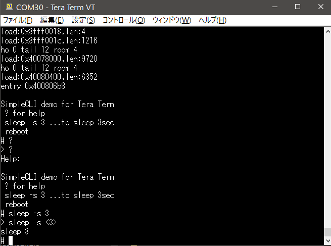

# SimpleCLI example for Tera Term

This is an example code for Arduino Command Interpreter
based on SimpleCLI by spacehuhn at https://github.com/spacehuhn/SimpleCLI

When ESP32devkitC is used as an embeded device, USB serial port is connected to Tera Term without echo back mode. 
This program echo backs key input and waits for CR or LF to process CLI. 

Only three commands are supported.
- ?  (for help)
- sleep -s 3 ( wait 3 seconds)
- reboot

backspace key works.

Fig.1 teraterm screen shot

